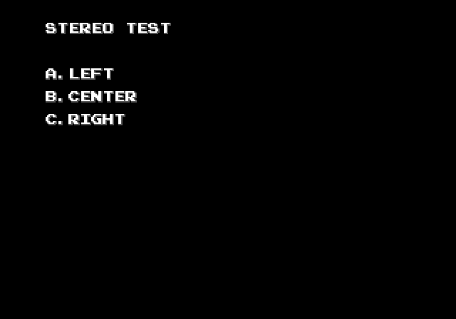

# Stereo test

Some quick test program that lets you check if a Mega Drive or clone is
outputting stereo or not. Download `stereo-test.bin`, load it into a
flashcart or whatever, then press A, B or C to play a drum at different
panning positions.

No real license for this thing (it was just a quick program), do whatever you
want with it.

## Building

On Linux:

* Grab an assembler and [`mdtiler`](https://github.com/sikthehedgehog/mdtools)
* Modify `build.sh` to point to the tools
* Run it

On Windows: ...look at `build.sh` and write the equivalent BAT file :P

## Echo

Included here is an Echo blob (especifically version 1.6), you can grab
Echo from [https://github.com/sikthehedgehog/echo/](https://github.com/sikthehedgehog/echo)
